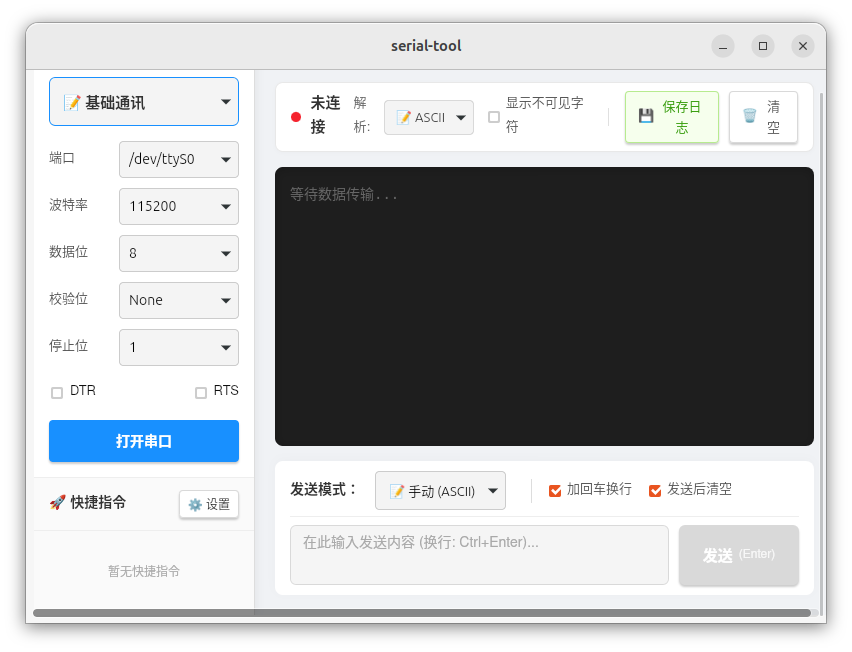

# 🔌 Serial Port Tool

一个基于 **Tauri + React + Rust** 的串口调试工具。  
由 Gemini Pro 辅助开发（初次尝试项目，欢迎找茬🐧）

## ✨ 功能特性

- 📡 串口扫描与连接
- 📤 数据发送（支持文本 / HEX / 文件发送/定时发送）
- 📥 数据接收（实时显示）
- 🧾 数据日志记录
- ⚙️ 波特率 / 数据位 / 校验位 / 停止位配置
- ✨跨平台支持（Windows / Linux / macOS）

## 📌 TODO

- [ ] 📊 串口数据波形显示（示波器功能）
- [ ] 🤖 编程式发送（脚本/自动化发送）
- [ ] 🎨 UI 优化
- [ ] 🧩 模块化架构重构

## 🖼️ 界面预览

